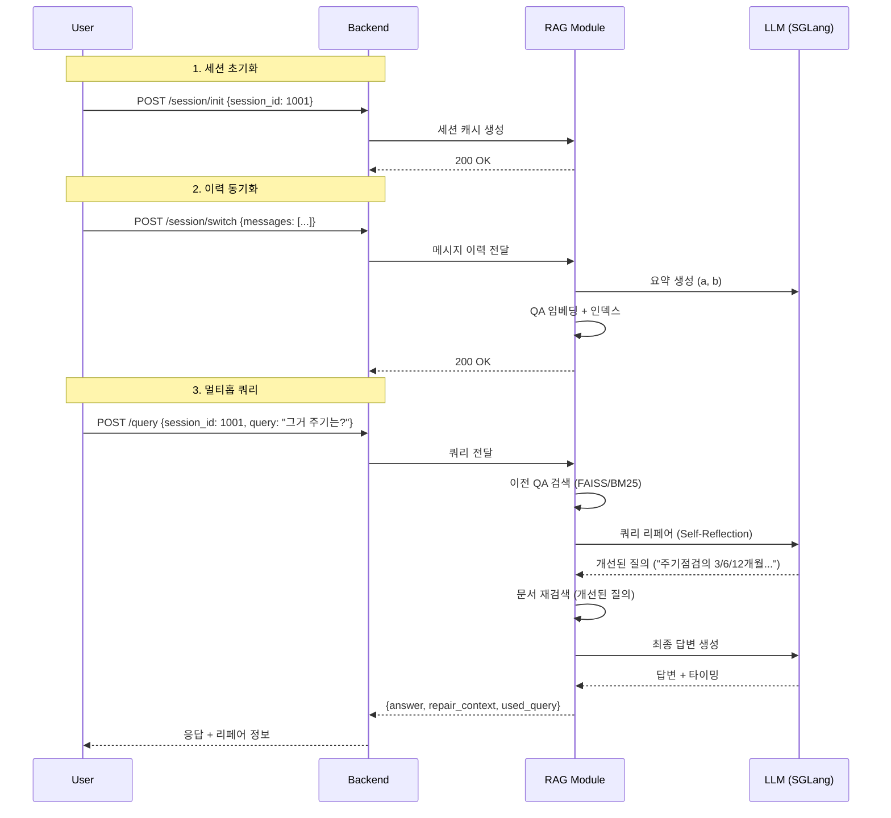

# RAG HTTP API - Multihop Edition

FastAPI 기반 RAG 서버 + **멀티홉 쿼리 증강** (Self-RAG/CRAG 스타일)

## ✨ 주요 기능

### 1. **세션 관리 (백엔드 주도)**
- 백엔드가 메시지 이력 보유 (SSOT)
- RAG는 요약/임베딩/인덱스만 캐시 (LRU 100개, TTL 72시간)
- `POST /session/init` - 세션 초기화
- `POST /session/switch` - 이력 동기화 및 요약 생성

### 2. **멀티홉 쿼리 증강**
- **Self-Reflection**: 이전 답변의 불확실성 감지
- **Query Decomposition**: 복잡한 질문 분해
- **Contextual Rewrite**: 모호한 대명사 제거, 독립적 질의 재작성
- **Assumption Tracking**: 불확실한 전제 명시

### 3. **평가 모드**
- `eval_mode=true` → 순수 Naive RAG (증강 비활성화)
- A/B 테스트 지원

## 🚀 빠른 시작

```bash
# 1. 환경 설정
python -m venv .venv && source .venv/bin/activate
pip install -r requirements.txt
cp .env.example .env
# .env에서 SGLANG_LLM_BASE_URL, SGLANG_EMBED_BASE_URL 설정

# 2. 서버 실행
bash scripts/uvicorn.sh

# 3. 문서 인덱싱
python clients/index_documents.py \
  --path ./data/railway_md_0923 \
  --recursive \
  --file-types md,txt,pdf

# 4. 세션 기반 쿼리 테스트
python clients/test_multihop.py

# 5. Gradio UI 실행
python clients/chatbot.py
```

## 📡 API 엔드포인트

### 세션 관리
```bash
# 초기화
curl -X POST http://localhost:8000/session/init \
  -H 'Content-Type: application/json' \
  -d '{"session_id": 1001, "new_session": true}'

# 스위치 (이력 동기화)
curl -X POST http://localhost:8000/session/switch \
  -H 'Content-Type: application/json' \
  -d '{
    "session_id": 1001,
    "messages": [
      {"id": 0, "user_query": "Q1", "rag_answer": "A1", "created_at": "2025-10-03T09:00:00Z"}
    ]
  }'
```

### 질의
```bash
# 멀티홉 (세션 기반)
curl -X POST http://localhost:8000/query \
  -H 'Content-Type: application/json' \
  -d '{
    "session_id": 1001,
    "query": "그거 주기가 어떻게 돼?",
    "top_k": 5,
    "eval_mode": false,
    "stream": false
  }' | jq

# 평가 모드 (Naive RAG)
curl -X POST http://localhost:8000/query \
  -H 'Content-Type: application/json' \
  -d '{
    "session_id": 1001,
    "query": "주기점검 절차는?",
    "eval_mode": true,
    "stream": false
  }' | jq
```

### 스트리밍
```bash
curl -N -X POST 'http://localhost:8000/query?stream=true' \
  -H 'Content-Type: application/json' \
  -d '{
    "session_id": 1001,
    "query": "그 절차 자세히 알려줘",
    "think_mode": "on",
    "include_reasoning": true
  }'
```

## 🧪 응답 예시

### 멀티홉 쿼리 증강
```json
{
  "answer": "주기점검은 3개월, 6개월, 12개월 주기로...",
  "used_query": "열차 정비의 주기점검(3개월/6개월/12개월) 각각의 구체적 절차와 점검 항목을 설명해주세요.",
  "repair_context": {
    "corrections": [
      "(turn_id=1) '그거'가 주기점검인지 특별점검인지 불명확 — [ambiguous]"
    ],
    "questions": [
      "1) 주기점검(3/6/12개월) 중 어느 주기를 말씀하시나요?",
      "2) 절차 전체 vs 특정 단계?",
    ],
    "improved_query": "열차 정비의 주기점검(3개월/6개월/12개월) 각각의 구체적 절차...",
    "assumptions": [
      "사용자가 이전 대화의 '주기점검'을 지칭한다고 가정"
    ]
  },
  "contexts": [...],
  "timing": {...}
}
```

## 🔬 쿼리 증강 방법론

### Self-RAG + CRAG 스타일 파이프라인
1. **이전 QA 검색** (세션 캐시 FAISS/BM25)
2. **Self-Reflection** → 불확실/오류 항목 감지
3. **Clarification** → 사용자 확인 질문 생성
4. **Query Rewrite** → 독립적 질의 재작성
   - 모호한 대명사 제거 ("그거" → "주기점검")
   - 시간/버전/환경 명시
   - 하위 질문 포함
5. **개선된 질의로 문서 재검색**

### 프롬프트 엔지니어링
- 최신 논문 참조: [Self-RAG](https://arxiv.org/abs/2310.11511), [CRAG](https://arxiv.org/abs/2401.15884), Iter-RetGen
- 비권위 힌트 처리: topk chunk를 사실로 단정하지 않음
- Assumption Tracking: 불확실한 전제 명시적 추적

## 🏗️ 아키텍처

```
┌─────────────┐  메시지 이력(SSOT)  ┌──────────────┐
│   Backend   │ ─────────────────→ │  RAG Module  │
│  (FastAPI)  │                     │ (임시 캐시)   │
└─────────────┘                     └──────────────┘
      ↓                                     ↓
 DB/Redis 등                      ./cache/session/{id}/
                                   ├── session_meta.json
                                   ├── faiss.index
                                   ├── bm25/
                                   └── chunks/*.jsonl
```

### 세션 캐시 구조
- `session_meta.json` - 전체 요약(a), 최근5 요약(b)
- `faiss.index` - QA 임베딩
- `bm25/` - BM25 인덱스
- LRU 정책: 100개 세션 유지, TTL 72시간

## ⚙️ 환경 변수

```bash
# 세션 관리
SESSION_CACHE_DIR=./cache/session
SESSION_MAX_COUNT=100
SESSION_TTL_HOURS=72
RECENT_QA_WINDOW=5

# 쿼리 리페어 (기존 LLM_MODEL 재사용)
ENABLE_QUERY_REPAIR=true
REPAIR_MAX_TOKENS=800
REPAIR_TEMPERATURE=0.3

# 요약 (기존 LLM_MODEL 재사용)
SUMMARY_MAX_TOKENS=600
```

## 📊 성능 측정

```bash
# 부하 테스트 (20개 동시 요청)
python scripts/smoke_load.py

# 멀티홉 정확도 평가
python clients/test_multihop.py
```

## 🎨 Gradio UI 사용법

1. **세션 초기화**: `Session ID` 입력 후 `Init Session` 클릭
2. **멀티턴 대화**: 
   - "열차 정비 절차가 뭐야?" → "그거 주기는?" → "특별점검은 언제?"
   - 우측에 쿼리 리페어 결과 표시
3. **평가 모드**: `Session ID=0` 설정 시 Naive RAG 동작

## 🔍 디버깅 팁

### 쿼리 증강 확인
```bash
# 로그에서 리페어 과정 확인
tail -f logs/rag.log | grep "Query repaired"
```

### 세션 캐시 확인
```bash
# 캐시 내용 조회
cat ./cache/session/1001/session_meta.json | jq

# 인덱스 파일 확인
ls -lh ./cache/session/1001/
```

### 문제 해결
1. **"Index not loaded"** → `python clients/index_documents.py` 먼저 실행
2. **쿼리 증강 안 됨** → `ENABLE_QUERY_REPAIR=true` 확인
3. **세션 캐시 없음** → `/session/switch`로 이력 동기화

## 📚 참고 문헌

- **Self-RAG**: [Self-Reflective Retrieval-Augmented Generation](https://arxiv.org/abs/2310.11511)
- **CRAG**: [Corrective Retrieval Augmented Generation](https://arxiv.org/abs/2401.15884)
- **Iter-RetGen**: [Iterative Retrieval-Generation](https://arxiv.org/abs/2305.15294)

## 🛣️ 로드맵

- [ ] **Query Decomposition**: 복잡한 질문 자동 분해
- [ ] **Evidence Verification**: 검색된 문서 신뢰도 평가
- [ ] **Dynamic Retrieval**: 답변 생성 중 추가 검색
- [ ] **Multi-Agent**: 여러 RAG 에이전트 협업

## 📝 라이선스

MIT License

---

## 🚦 전체 워크플로우



## 🎯 핵심 차별점

| 기능 | 기존 RAG | 멀티홉 RAG (이 프로젝트) |
|------|----------|--------------------------|
| 세션 관리 | ❌ | ✅ 백엔드 SSOT |
| 쿼리 증강 | 단순 키워드 확장 | Self-Reflection + Rewrite |
| 대화 이력 활용 | ❌ | ✅ 이전 QA 검색 + 요약 |
| 평가 모드 | ❌ | ✅ A/B 테스트 지원 |
| 불확실성 처리 | 무시 | Assumption Tracking |

## 💡 사용 예시

### 예시 1: 모호한 대명사 해결
```
[Turn 1]
User: 열차 정비 절차가 뭐야?
RAG: 일상점검, 주기점검, 특별점검으로 나뉩니다.

[Turn 2] 
User: 그거 주기가 어떻게 돼?
❌ Naive RAG: "그거"를 이해 못함 → 부정확한 답변
✅ Multihop RAG: 
   - 이전 QA 검색 → "주기점검" 감지
   - 쿼리 리페어 → "주기점검의 3/6/12개월 주기별 절차"
   - 정확한 답변 생성
```

### 예시 2: 불확실성 명시
```
User: 그 장비 교체 주기는?
Repair Context:
  - 정정 대상: (turn_id=2) "그 장비"가 브레이크/엔진/전기계통 중 불명확 — [ambiguous]
  - 확인 질문: 1) 어느 장비를 말씀하시나요? (브레이크/엔진/전기)
  - 개선된 질의: "열차 정비에서 브레이크/엔진/전기계통 각각의 교체 주기 기준"
  - 가정: 사용자가 이전 대화의 '브레이크'를 지칭한다고 가정
```

## 🔧 커스터마이징

### 쿼리 리페어 프롬프트 수정
`app/services/query_repair.py`의 `REPAIR_PROMPT_V2` 편집:
```python
# 도메인 특화 지시사항 추가
REPAIR_PROMPT_V2 += """
[도메인 특화 규칙]
- 열차 모델명은 반드시 명시 (KTX/SRT/무궁화 등)
- 안전 관련 질문은 최우선 처리
- 수치는 단위 포함 (mm/kg/MPa 등)
"""
```

### 세션 캐시 정책 조정
`.env`:
```bash
SESSION_MAX_COUNT=200      # LRU 캐시 크기
SESSION_TTL_HOURS=168      # 1주일
RECENT_QA_WINDOW=10        # 최근 10개 QA 요약
```

## 📞 지원

- **이슈**: GitHub Issues
- **문서**: [docs/](./docs/)
- **예제**: [examples/](./examples/)

---

**Built with ❤️ using FastAPI + LlamaIndex + SGLang**